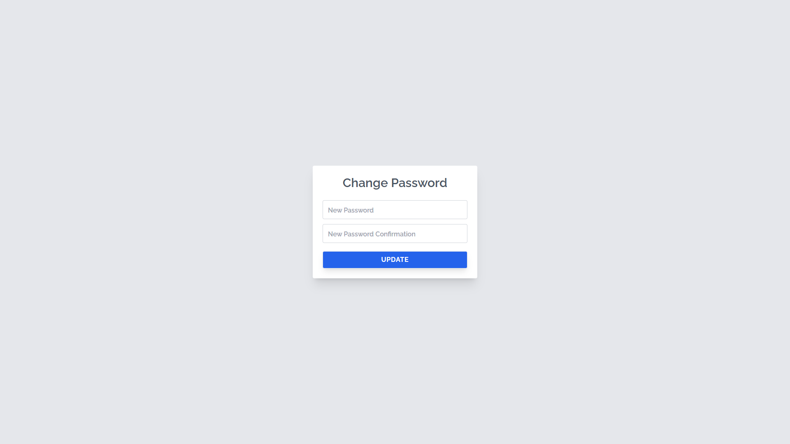
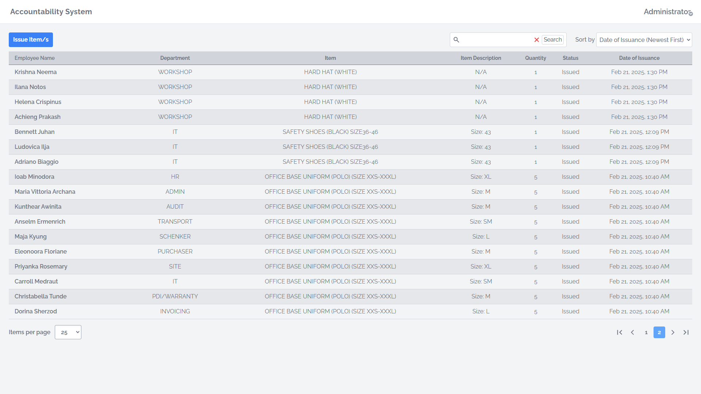
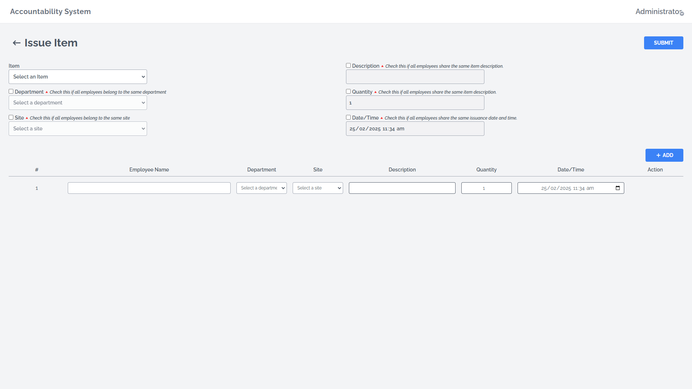
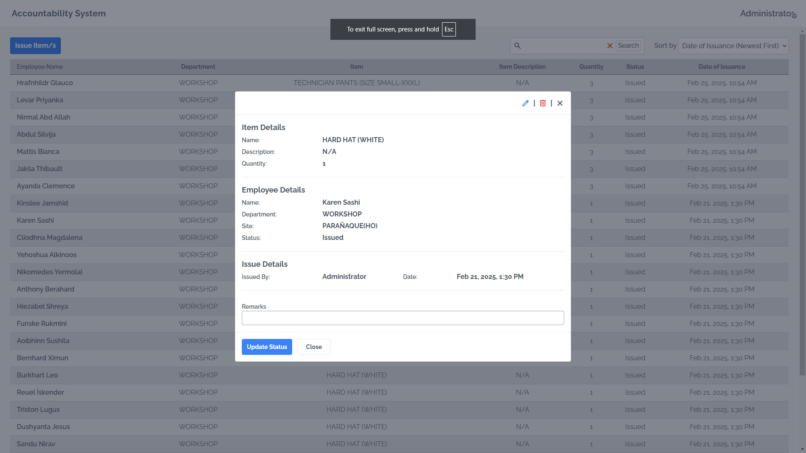
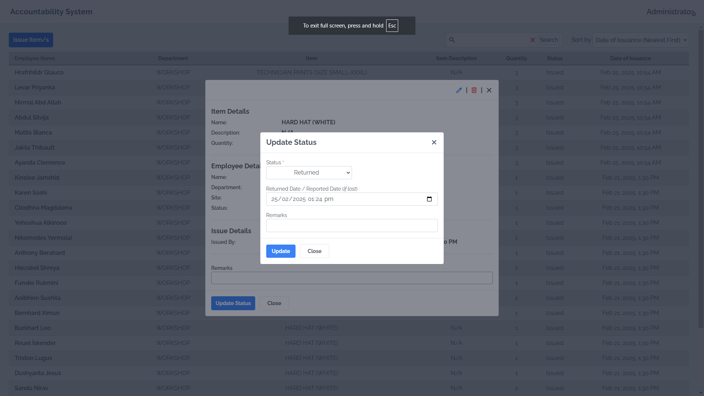

<h1>Accountability System</h1>

A web application for tracking company-issued items to employees. It records borrowed items, monitors their status, and logs returns to ensure accountability and proper asset management.
 

## Installation

#### Prerequisites
Before installing, ensure you have the following installed on your system:
- [Node.js](https://nodejs.org/en)
- [Git](https://git-scm.com/downloads)

#### Steps to Install
1. Clone the repository

~~~
git clone https://github.com/nairAnhoJ/accountability-system.git
cd accountability-system
~~~

2. Install dependencies
~~~
npm install
~~~

3. Set up environment variables
~~~
cp .env.example .env
# Update the environment variables as needed.
~~~

4. Start the development server
~~~
npm run dev
~~~

5. Build for production (optional)
~~~
npm run build
~~~

6. Run the production build
~~~
npm run preview
~~~

 
 

## How to use the application

#### **1. Logging In**
Open the web application in your browser.  
Enter your ID number and password, then click **'Login'**.

#### **2. First Time Login**
If this is your first time logging on, you will be required to change your password.
- Fill in all the required fields.
- Click **'Update'**.

#### **3. Viewing Issued Items**
Once logged in, you will see a list of all issued items.

#### **4. Issuing a New Item**
- Click the **'Issue Item/s'** button to open the issue items form.
- Fill in the necessary details.
- Click **'Submit'**.

**Bulk Adding Employees:**  
- Click the **'Add'** button.
- Fill in all the required fields.
- Click **'Submit'**.

#### **5. Viewing Item Details**
- In the **Issued Items List**, click on a row to see more details.

#### **6. Updating an Item's Status**
- In the modal, click the **'Update Status'** button.
- Change the item's status from **'Issued'** to either **'Returned'**, **Replaced** or **'Lost'**.
- Fill in the form, then click **'Update'**.

